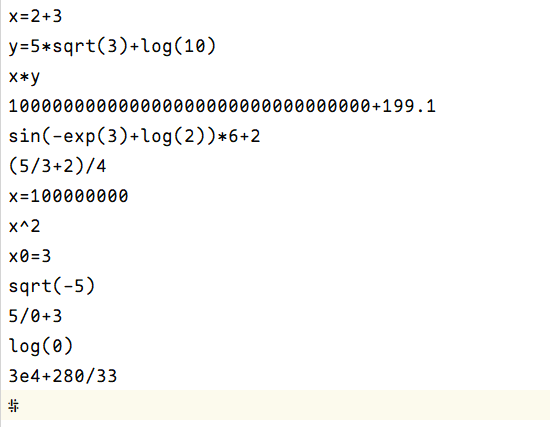
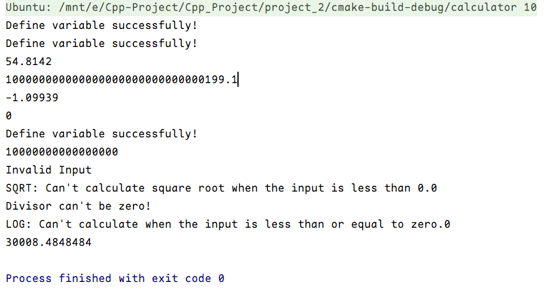
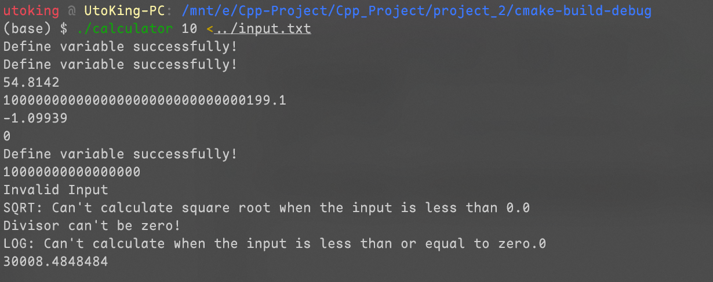

# Report on Improved Calculator

Name: MIAO Fangran

Student ID: 11911819

---

## PART 1: Analysis

在这个问题中, 我们会像计算器一样输入很多的表达式并计算出结果. 如下问题需要我们解决.

首先是**高精度的加减乘除**. 因为我们在 [Project 1](../project_1/README.md) 时已经完成了乘法的高精度实现, 这里只需要在此基础上更进一步.

实现加减法时需要注意小数点的对齐, 这一步可以在小数点位数较少的数后面补 0, 然后做整数的加减法. 当遇到 $3+(-2)$ 这种式子的时候则会单独判断, 并跳转到减法进行实现.

实现除法时也有小数点的问题, 而此时我们可以将两个数一起乘以 $10^n$, 这样子就可以先转化为整数除法. 即 $5.123\div 2.34$ 转化为 $ 5123\div 2340$ 进行计算. 而得出答案的小数点位数与被除数的小数点位数相同. 除法还有一个需要考虑的小点是精度问题, 对于像 $1/3$ 这种无限不循环小数或者无理数这种, 我们是不可能保留所有位数的, 所以为了统一, 我们设置了有效数字为 20 位. 当然用户也可以命令行参数中修改精度 (如下所示).

```bash
./calculator 10
```

对于实现 `string` 类型的加减乘除我统一了各自的方法. 即每个运算会有两个函数, 分别计算 `string` 类型的加减乘除和 `vector<int>` 加减乘除. 其中 `string` 类型主要实现各种输入的运算而 `vector<int>` 主要负责整数(或很长的整数) 的运算. 使用这个会也让各个函数的交互变得更加容易实现 (比如在做除法的时候会用到 `strMultiply.cpp `和 `strMinus.cpp` ).

其次要解决的问题是**如何识别输入并转化**. 在这个过程中我们需要用到逆波兰表达式. 该表达式可以把我们习惯用的中缀表达式转化为后缀表达式来计算. 且这里面不会出现任何的括号.

要实现这个我们需要从左到右依次扫描, 在这之中会将加减的优先级设为 1, 乘除的优先级设为 2, 次方 (^) 的优先级设为 3, 一些基本函数的优先级设为 4. 而括号的优先级设为 10. 当加法 (或其他算数) 出现在括号里时, 优先级会相应的加 10. 这之后就可以实现算数的优先级了并相继转为逆波兰表达式.

以下为一个逆波兰表达式的例子, 如 $(1+2)*(3-5/4)$ 的逆波兰表达式为 $1\ 2 + 3\ 5\ 4\ / - *$

然后就需要解决**怎么计算**, 因为已经转化为了逆波兰表达式了, 我们就可以用一个数字栈进行计算. 从左往右扫描逆波兰表达式, 当遇到数字时就会进栈, 当遇到加减乘除和次方时就从中拿两个数进行计算, 并将得出的结果再放回数字栈中. 当遇到基本函数时就从数字栈中拿一个数出来计算, 计算完成后再放入数字栈中. 直到逆波兰表达式扫描完成后取栈顶的元素即可 (因为此时理论上只可能会有一个数字了).

最后是**定义变量和计算**. 定义变量时需要我们判断该步骤是否在定义变量, 而不是在做无意义的操作. 这里就会再一次用到正则表达式. 判断的正则为

```
^([a-zA-Z])=(.+)$
```

判断完之后我们只需要提取两个括号里的内容即可.

这里的判断及提取需要有两点注意的地方. 第一为比较符合计算器的设定, 我们的变量都是一个字符的字母, 即不会接受诸如 `x1, x_0` 这种输入. 第二, 输入的右端可以为单个值, 也可以为表达式. 比如如下的几个例子均是符合输入规范的.

```
x=5+2
y=7
z=sqrt(3)*2+log(3)
```

在上述步骤完成后我们会把变量和变量值存入一个字典, 如果先前已经存储过了该变量则会更新这个变量的值.

要将这些变量加入计算则需要在转化的时候加上额外的判定条件. 即如果出现 `a-z A-Z` 的字母, 则会查询字典, 并将查询得到的值压入逆波兰表达式里.

**另外**, 本次 project 有以下的基本函数 $\log \ \sin\ \cos\ \tan\ \cot\ \exp \ \text{sqrt}$. 其中 $\log$ 是以 $e$ 为底的对数.

## PART 2: Code

### strDivision.cpp

此处就只展示 strDivision, 其余的方法一样, 均可在相应名字的代码文件中找到

```c++
#include "strDivision.h"
#include "strMultiply.h"
#include "numberFunctions.h"
#include "strMinus.h"
#include "cmath"

using namespace std;

string strDivision(string s1, string s2, int precision) {
    /**
     * @brief return the result of s1 / s2.
     * @param s1 the dividend or the numerator.
     * @param s2 the divisor of the denominator.
     * @param precision the precision you want, default is 20.
     * @return the result of s1 / s2.
     *
     * Perform the division operation and return a string with precision you want.
     */

    if (!(isNumber(s1) || isScientific(s1))) {
        return "First input is Not a Number or Not Standard!";
    }

    if (!(isNumber(s2) || isScientific(s2))) {
        return "Second input is Not a Number or Not Standard!";
    }

    if (isScientific(s1)) {
        s1 = scientific2Double(s1);
    }

    if (isScientific(s2)) {
        s2 = scientific2Double(s2);
    }

    if (format(s1) == "0") return "0";
    if (format(s2) == "0") return "The divisor can't be zero!";

    int decimal1 = 0;
    int decimal2 = 0;

    int n;
    if ((n = s1.find('.')) != string::npos) {
        decimal1 = s1.length() - n - 1;
    }
    if ((n = s2.find('.')) != string::npos) {
        decimal2 = s2.length() - n - 1;
    }

    string multiplier = "1";
    if (decimal2 > decimal1) multiplier.append(decimal2, '0');
    else multiplier.append(decimal1, '0');

    s1 = strMultiply(s1, multiplier);
    s2 = strMultiply(s2, multiplier);

    vector<int> a1;
    vector<int> a2;

    int sign = 1;

    for (char i: s1) {
        if (i == '-') sign *= -1;
        else if (i != '+') {
            a1.push_back(i - '0');
        }
    }

    for (char i: s2) {
        if (i == '-') sign *= -1;
        else if (i != '+') {
            a2.push_back(i - '0');
        }
    }

    string result_str = vector2String(integerDivision(a1, a2, precision));

    result_str.insert(a1.size(), ".");
    result_str = format(result_str);
    if (sign == -1) result_str.insert(0, "-");

    return result_str;
}

vector<int> integerDivision(vector<int> &a1, vector<int> &a2, int precision) {
    vector<int> result;
    vector<int> dividend = {a1[0]};
    int index = 1;

    for (int i = 0; i < precision; ++i) {
        if (compare(dividend, a2)) {
            for (int j = 2; j <= 10; ++j) {
                vector<int> t1 = {j};
                vector<int> t2 = integerMultiply(a2, t1);
                if (!compare(dividend, t2)) {
                    result.push_back(j - 1);
                    t1 = {j - 1};
                    t2 = integerMultiply(a2, t1);
                    dividend = integerMinus(dividend, t2);
                    break;
                }
            }
            if (dividend.empty() && index >= a1.size()) break;
            if (index < a1.size()) dividend.push_back(a1[index]);
            else dividend.push_back(0);
            index++;
        } else {
            result.push_back(0);
            if (index < a1.size()) dividend.push_back(a1[index]);
            else dividend.push_back(0);
            index++;
        }
    }

    return result;
}


```

### PRN_convert.cpp

```c++
#include <vector>
#include <stack>
#include "RPN_convert.h"
#include "string"
#include "numberFunctions.h"

using namespace std;

vector<string> transToRPN(string s, map<char, string> &variable) {
    vector<string> ans;
    stack<pair<string, int>> op_stack;
    stack<char> brackets;
    map<char, string>::iterator iter;

    int n = s.length();
    for (int i = 0; i < n; i++) {
        if (s[i] >= '0' && s[i] <= '9') {
            string temp;
            while ((s[i] >= '0' && s[i] <= '9') || s[i] == 'e' || s[i] == 'E') {
                temp.push_back(s[i]);
                i++;
            }
            if (isNumber(temp) || isScientific(temp))
                ans.push_back(temp);
            else {
                cout << "Input is not valid!";
                vector<string> empty;
                return empty;
            }
            i--;

        } else if ((iter = variable.find(s[i])) != variable.end()) {
            ans.push_back(iter->second);
        } else if (s[i] == '+' || s[i] == '-') {
            int current_priority = brackets.size() * 10 + 1;
            string temp(1, s[i]);
            pair<string, int> p({temp, current_priority});
            if (i == 0 || s[i - 1] == '(') ans.emplace_back("0");
            if (op_stack.empty()) {
                op_stack.push(p);
            } else {
                pair<string, int> last_node = op_stack.top();
                if (current_priority > last_node.second) {
                    op_stack.push(p);
                } else {
                    while (!op_stack.empty() && current_priority <= op_stack.top().second) {
                        ans.push_back(op_stack.top().first);
                        op_stack.pop();
                    }
                    op_stack.push(p);
                }
            }
        } else if (s[i] == '*' || s[i] == '/') {
            int current_priority = brackets.size() * 10 + 2;
            string temp(1, s[i]);
            pair<string, int> p({temp, current_priority});
            if (op_stack.empty()) {
                op_stack.push(p);
            } else {
                pair<string, int> last_node = op_stack.top();
                if (current_priority > last_node.second) {
                    op_stack.push(p);
                } else {
                    while (!op_stack.empty() && current_priority <= op_stack.top().second) {
                        ans.push_back(op_stack.top().first);
                        op_stack.pop();
                    }
                    op_stack.push(p);
                }
            }
        } else if (s.substr(i, 3) == "sin" || s.substr(i, 3) == "cos" || s.substr(i, 3) == "cot" ||
                   s.substr(i, 3) == "exp" || s.substr(i, 3) == "log" || s.substr(i, 3) == "tan") {
            int current_priority = brackets.size() * 10 + 4;
            string temp = s.substr(i, 3);
            pair<string, int> p({temp, current_priority});
            i += 2;
            if (op_stack.empty()) {
                op_stack.push(p);
            } else {
                pair<string, int> last_node = op_stack.top();
                if (current_priority > last_node.second) {
                    op_stack.push(p);
                } else {
                    while (!op_stack.empty() && current_priority <= op_stack.top().second) {
                        ans.push_back(op_stack.top().first);
                        op_stack.pop();
                    }
                    op_stack.push(p);
                }
            }
        } else if (s.substr(i, 4) == "sqrt") {
            int current_priority = brackets.size() * 10 + 4;
            string temp = s.substr(i, 4);
            pair<string, int> p({temp, current_priority});
            i += 3;
            if (op_stack.empty()) {
                op_stack.push(p);
            } else {
                pair<string, int> last_node = op_stack.top();
                if (current_priority > last_node.second) {
                    op_stack.push(p);
                } else {
                    while (!op_stack.empty() && current_priority <= op_stack.top().second) {
                        ans.push_back(op_stack.top().first);
                        op_stack.pop();
                    }
                    op_stack.push(p);
                }
            }
        } else if (s[i] == '^') {
            int current_priority = brackets.size() * 10 + 3;
            string temp(1, s[i]);
            pair<string, int> p({temp, current_priority});
            if (op_stack.empty()) {
                op_stack.push(p);
            } else {
                pair<string, int> last_node = op_stack.top();
                if (current_priority > last_node.second) {
                    op_stack.push(p);
                } else {
                    while (!op_stack.empty() && current_priority <= op_stack.top().second) {
                        ans.push_back(op_stack.top().first);
                        op_stack.pop();
                    }
                    op_stack.push(p);
                }
            }
        } else if (s[i] == '(') {
            brackets.push(s[i]);
        } else if (s[i] == ')') {
            brackets.pop();
        } else {
            vector<string> empty;
            return empty;
        }
    }

    while (!op_stack.empty()) {
        ans.push_back(op_stack.top().first);
        op_stack.pop();
    }

    return ans;
}

```

### defineVariable.cpp

```c++

#include "defineVariable.h"
#include "string"
#include "map"
#include "regex"
#include "RPN_convert.h"
#include "calculator.h"

using namespace std;

bool isDefine(const string &s, map<char, string> &m) {
    regex regex1("^([a-zA-Z])=(.+)$");
    smatch result;
    bool ret = regex_match(s, result, regex1);
    if (ret) {
        string s1 = result[1];
        string s2 = result[2];
        vector<string> rpn = transToRPN(s2, m);
        s2 = calculator(rpn);
        map<char, string>::iterator n;
        if ((n = m.find(s1[0])) != m.end()) {
            n->second = s2;
        } else {
            m[s1[0]] = s2;
        }
    }
    return ret;
}
```

### calculator.cpp

```c++
//
// Created by UtoKing on 2022/10/12.
//

#include "calculator.h"
#include "string"
#include "vector"
#include "stack"
#include "numberFunctions.h"
#include "strAdd.h"
#include "strMinus.h"
#include "strMultiply.h"
#include "strDivision.h"
#include "basicFunction.h"

using namespace std;

string calculator(const vector<string> &vs, int precision) {
    stack<string> num;
    for (auto &v: vs) {
        if (isNumber(v) || isScientific(v)) {
            num.push(v);
        } else if (v == "+" || v == "-" || v == "*" || v == "/" || v == "^") {
            string a2 = num.top();
            num.pop();
            string a1 = num.top();
            num.pop();

            if (v == "+") {
                string r = strAdd(a1, a2);
                num.push(r);
            } else if (v == "-") {
                string r = strMinus(a1, a2);
                num.push(r);
            } else if (v == "*") {
                string r = strMultiply(a1, a2);
                num.push(r);
            } else if (v == "/") {
                string r = strDivision(a1, a2, precision);
                num.push(r);
            } else {
                string r = str_pow(a1, a2);
                num.push(r);
            }
        } else {
            string a = num.top();
            num.pop();
            if (v == "sqrt") {
                string r = str_sqrt(a);
                num.push(r);
            } else if (v == "sin") {
                string r = str_sine(a);
                num.push(r);
            } else if (v == "cos") {
                string r = str_cosine(a);
                num.push(r);
            } else if (v == "tan") {
                string r = str_tangent(a);
                num.push(r);
            } else if (v == "cot") {
                string r = str_cotangent(a);
                num.push(r);
            } else if (v == "exp") {
                string r = str_exponential(a);
                num.push(r);
            } else if (v == "log") {
                string r = str_log(a);
                num.push(r);
            }
        }
    }
    return num.top();
}
```

### main.cpp

```c++
#include <iostream>
#include "string"
#include "RPN_convert.h"
#include "calculator.h"
#include "cmath"
#include "defineVariable.h"
#include "map"

using namespace std;

int main(int argc, char *argv[]) {
    int precision = 20;
    if (argc == 2)
        stoi(argv[1]) <= 0 ? precision = 20 : precision = stoi(argv[1]);

    map<char, string> variable;

    while (true) {
        string input;
        getline(cin, input);
        if (input == "#") break;
        else if (isDefine(input, variable)) {
            cout << "Define variable successfully!" << endl;
            continue;
        } else {
            vector<string> rpn = transToRPN(input, variable);
            if (rpn.empty()) {
                cout << "Invalid Input" << endl;
                continue;
            }
            string result = calculator(rpn, precision);
            cout << result << endl;
        }
    }
}
```

其他的 `numberFunctions.cpp`, `basicFunction.cpp` 均未在此展示, 里面主要是一些辅助函数以及调用 `cmath` 的包实现的基本函数.

## PART 3: Verification

在这一部分做了数十个左右的测试, 因为输入可能会很长的缘故, 所以做了输入的重定向, 即由 `input.txt` 来进行输入 (这一部分没有上传到 GitHub 上, 因为这一部分可以由用户自定义).

测试时输入在命令行输入以下命令 (其中 10 为用户设置的精度, 是命令行参数).

```bash
./calculator 10 <input.txt
```

输入输出的截图如下.

Input



Output



Shell Screenshot



## PART 4: Difficulties and Solutions

因为在第一部分已经对问题和解决方案做了详细的阐明, 这里做一下总结.

首先是高精度的加减乘除, 依然采用字符串之间的运算, 并额外引入了 `vector<int>` 的运算加强了代码之间的互通性.

对于如何输入识别和转化, 采用了将输入转化为逆波兰表达式的方法, 并用栈对逆波兰表达式进行计算.

最后是定义变量与计算. 我们依旧采用正则表达式进行变量定义的判断, 并将定义后的值当作 key 和 value 存储在字典中. 当在转化成逆波兰表达式的时候就调用字典, 以此来计算.
